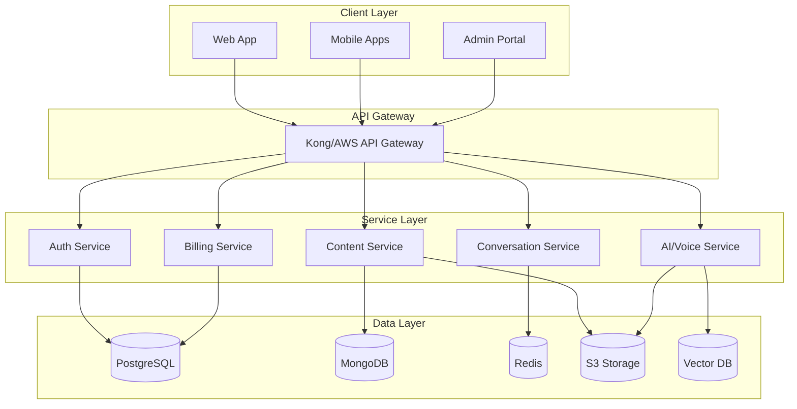

# EthernalEcho

<div align="center">
  
  
  **Preserving Voices, Connecting Hearts, Transcending Time**

  [](LICENSE)
  [](https://github.com/ethernalecho/ethernalecho)
  [](SECURITY.md)
  [](COMPLIANCE.md)
  
  [Website](https://ethernalecho.com) • [Documentation](https://docs.ethernalecho.com) • [Support](https://support.ethernalecho.com)
</div>

## 🌟 Overview

EthernalEcho is a revolutionary SaaS platform that enables individuals to preserve their consciousness, personality, and voice through advanced artificial intelligence. By creating interactive digital representations, families can maintain meaningful connections with loved ones beyond physical life.

### Key Features

- 🎙️ **Advanced Voice Synthesis** - Perfect voice replication using cutting-edge AI technology
- 🧠 **Personality Modeling** - Custom AI models that capture unique personality traits and behaviors
- 💬 **Interactive Conversations** - Real-time voice and text interactions with AI representations
- 🔒 **Enterprise Security** - End-to-end encryption and HIPAA-compliant infrastructure
- 👨‍👩‍👧‍👦 **Family Sharing** - Secure access for designated family members
- 📱 **Cross-Platform** - Available on web, iOS, and Android
- 🌐 **Multi-Language** - Support for 20+ languages (coming soon)

## 🚀 Getting Started

### For Users

1. **Sign Up** at [ethernalecho.com](https://ethernalecho.com)
2. **Create Your Profile** with personal information and stories
3. **Record Your Voice** with our guided recording sessions (minimum 30 minutes)
4. **Train Your AI** through interactive personality sessions
5. **Invite Family Members** to share your digital legacy

### For Developers

#### Prerequisites

- Node.js 20.x or higher
- Python 3.11 or higher
- Docker and Docker Compose
- PostgreSQL 15+
- Redis 7+
- CUDA-capable GPU (for AI model training)

#### Quick Start

```bash
# Clone the repository
git clone https://github.com/ethernalecho/ethernalecho.git
cd ethernalecho

# Install dependencies
npm install
pip install -r requirements.txt

# Set up environment variables
cp .env.example .env
# Edit .env with your configuration

# Start development servers
docker-compose up -d

# Run database migrations
npm run migrate

# Start the application
npm run dev
```

## 📁 Project Structure

```
ethernalecho/
├── apps/
│   ├── web/                 # Next.js web application
│   ├── mobile/              # React Native mobile app
│   └── admin/               # Admin dashboard
├── services/
│   ├── auth/                # Authentication service
│   ├── content/             # Content management service
│   ├── ai-voice/            # Voice synthesis service
│   ├── ai-personality/      # Personality modeling service
│   ├── conversation/        # Real-time conversation service
│   └── billing/             # Subscription management
├── packages/
│   ├── ui/                  # Shared UI components
│   ├── utils/               # Common utilities
│   └── types/               # TypeScript type definitions
├── infrastructure/
│   ├── docker/              # Docker configurations
│   ├── k8s/                 # Kubernetes manifests
│   └── terraform/           # Infrastructure as Code
└── docs/                    # Documentation
```

## 🛠️ Technology Stack

### Frontend
- **Web**: React 18, Next.js 14, TypeScript, TailwindCSS
- **Mobile**: React Native, TypeScript, React Navigation
- **State Management**: Zustand, React Query
- **Real-time**: Socket.io, WebRTC

### Backend
- **API**: Node.js, Express, GraphQL, Python FastAPI
- **AI/ML**: PyTorch, Transformers, LangChain, Coqui TTS
- **Databases**: PostgreSQL, MongoDB, Redis, Vector DB
- **Message Queue**: RabbitMQ, Bull
- **Storage**: AWS S3, CloudFront CDN

### Infrastructure
- **Container**: Docker, Kubernetes
- **Cloud**: AWS/GCP/Azure (Multi-cloud)
- **Monitoring**: Prometheus, Grafana, ELK Stack
- **CI/CD**: GitLab CI, ArgoCD

## 📊 Architecture



## 💳 Subscription Plans

| Plan | Monthly | Annual | Storage | Family Members | Features |
|------|---------|--------|---------|----------------|----------|
| **Lite** | Free | Free | 5GB | 2 | Basic voice & AI |
| **Standard** | TBD | TBD | 25GB | 5 | + Video messages |
| **Premium** | TBD | TBD| 100GB | 10 | + Holographic preview |
| **Lifetime** | - | TBD | Unlimited | Unlimited | All features + 100-year guarantee |

## 🔒 Security & Privacy

- **End-to-end encryption** for all data
- **HIPAA compliant** infrastructure
- **GDPR & CCPA** compliant
- **SOC 2 Type II** certified
- **Zero-knowledge architecture** where possible
- **Biometric authentication** support

Read our [Security Policy](SECURITY.md) for more details.

## 🤝 Contributing

We welcome contributions! Please see our [Contributing Guidelines](CONTRIBUTING.md) for details.

### Development Workflow

1. Fork the repository
2. Create a feature branch (`git checkout -b feature/amazing-feature`)
3. Commit your changes (`git commit -m 'Add amazing feature'`)
4. Push to the branch (`git push origin feature/amazing-feature`)
5. Open a Pull Request

### Code Standards

- Follow the [TypeScript Style Guide](docs/typescript-style-guide.md)
- Follow the [Python Style Guide](docs/python-style-guide.md)
- Write unit tests for all new features
- Maintain 80%+ code coverage
- Pass all linting and security checks

## 📚 Documentation

- [API Documentation](https://docs.ethernalecho.com/api)
- [User Guide](https://docs.ethernalecho.com/guide)
- [Developer Guide](https://docs.ethernalecho.com/developer)
- [AI Model Documentation](https://docs.ethernalecho.com/ai)
- [Security & Compliance](https://docs.ethernalecho.com/security)

## 🧪 Testing

```bash
# Run all tests
npm test

# Run unit tests
npm run test:unit

# Run integration tests
npm run test:integration

# Run e2e tests
npm run test:e2e

# Run AI model tests
python -m pytest tests/ai/

# Generate coverage report
npm run test:coverage
```

## 📈 Monitoring

- **Metrics**: Prometheus + Grafana dashboards
- **Logs**: ELK Stack (Elasticsearch, Logstash, Kibana)
- **Traces**: Jaeger distributed tracing
- **Errors**: Sentry error tracking
- **Uptime**: StatusPage.io

## 🚦 Deployment

### Staging
```bash
npm run deploy:staging
```

### Production
```bash
npm run deploy:production
```

See [Deployment Guide](docs/deployment.md) for detailed instructions.

## 📞 Support

- **Documentation**: [docs.ethernalecho.com](https://docs.ethernalecho.com)
- **Email**: support@ethernalecho.com
- **Enterprise**: enterprise@ethernalecho.com
- **Security Issues**: security@ethernalecho.com

## 🗺️ Roadmap

### Phase 1 (Q2 2025)
- ✅ Core voice synthesis
- ✅ Basic personality modeling
- ✅ Family sharing
- 🔄 Mobile apps
- 🔄 Multi-language support

### Phase 2 (Q3 2025)
- 📅 Emotion detection
- 📅 Advanced AI features
- 📅 API platform
- 📅 Enterprise features

### Phase 3 (Q4 2025)
- 📅 Holographic displays
- 📅 VR integration
- 📅 Brain-computer interface research

### Phase 4 (2026+)
- 📅 Robotic avatars
- 📅 Quantum computing integration
- 📅 Global memorial network

## 🏆 Awards & Recognition

- 🥇 **Best AI Innovation** - TechCrunch Disrupt 2024
- 🏅 **Most Impactful Startup** - AI Summit 2024
- 🌟 **Editor's Choice** - Product Hunt

## 📄 License

This project is proprietary software. See the [LICENSE](LICENSE) file for details.

## 🙏 Acknowledgments

- Our beta testers for invaluable feedback
- The open-source community for amazing tools
- Our advisors and investors for believing in our vision
- Most importantly, the families we serve

---

<div align="center">
  <strong>EthernalEcho - Where Love Lives Forever</strong>
  
  Made with ❤️ by the EthernalEcho Team
</div>
